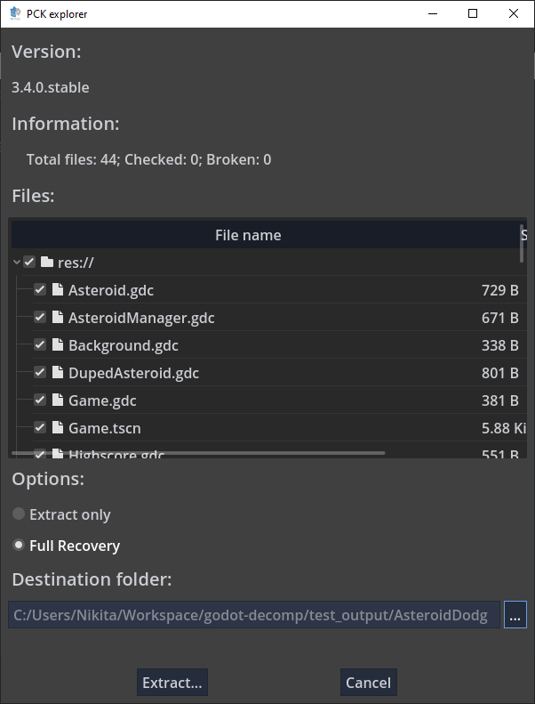
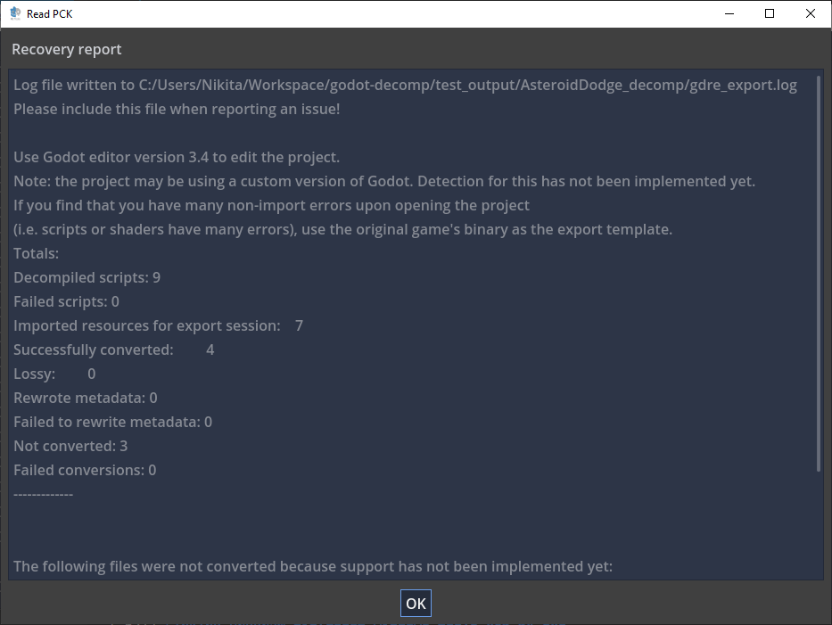

# Godot RE Tools

*This software in an alpha stage. Please report any bugs on the github page.*

## Introduction


This module includes following tools:

- Full project recovery
- PCK archive extractor / creator.
- GDScript batch decompiler.
- Resource text <-> binary batch converter.

Full project recovery performs the following:
- Loads project resources from an APK, PCK, or embedded EXE file
- Decompiles all GDScript scripts
- Recovers the original project file
- Converts all imported resources back to their original import formats
- Converts any auto-converted binary resources back to their original text formats
- Recreates any plugin configuration files

This module has support for decompiling Godot 4.x, 3.x, and 2.x projects.

Grab the latest release version from here: https://github.com/bruvzg/gdsdecomp/releases
## Limitations

Support has yet to be implemented for converting the following resources:
- ADPCM wavs
- Fonts
- Translation files
- Models (`obj`, `dae`, `fbx`, `glb`, etc.)

In addition, it does not support decompiling any GDNative or GDMono scripts. For Mono/CSharp, you can use [Ilspy](https://github.com/icsharpcode/ILSpy) or dotPeek.

## Usage

### GUI

- To perform full project recovery from the GUI, select "Recover project..." from the "RE Tools" menu:

- If the project is encrypted, select the "Set encryption key..." menu option first first and enter the key.
- In the file dialog, select the apk, pck, or embedded exe you want to recover:


- In the PCK explorer dialog, select "Full Recovery" or "Extract Only", then select the directory you want to recover the project to, then click "Extract...":


- After it finishes, it will pop up a recovery box telling you the location of the log file, what editor version you should use when editing the recovered project, report any non-recovered assets:



### Command Line

```bash
gdre_tools --headless --recover=game.pck
```

#### Optional arguments:
- `--output-dir=<out_dir>` : Output directory, defaults to `<NAME>_extracted`, or the project directory if one is specified
- `--key=<key>` : The Key to use if PAK/EXE/APK is encrypted (64 character hex string)

Use the same Godot tools version that the original game was compiled in to edit the project; the recovery log will state what version was detected.

## Compiling from source

Clone this repository into Godot's `modules` subfolder as `gdsdecomp`.
Rebuild Godot engine as described in https://docs.godotengine.org/en/latest/development/compiling/index.html.

### Requirements

Godot 4.0 (master branch) @ commit https://github.com/godotengine/godot/commit/daf168f4c821980a6a06fde67057f6a14d9e20c6
- Support for building on 3.x has been dropped and no new features are being pushed
	- Godot RE Tools still retains the ability to decompile 3.x and 2.x projects, however.

### Standalone

Assuming you compiled with `scons platform=linuxbsd target=template_debug`,

```bash
$ bin/godot.linuxbsd.template_debug.x86_64.llvm --headless --path=modules/gdsdecomp/standalone --recover=<pck/apk/exe>
```

## License

The source code of the module is licensed under MIT license.

[](https://travis-ci.org/bruvzg/gdsdecomp)
